## 前言

在换了一个bbr脚本之后，一觉醒来发现节点都`timeout`了，所以一度以为是bbr造成的问题，然后换了`bbr脚本`和`kernel`，问题依旧，感觉到似乎事情不太对,但是依然没往这方面想，因为真的太快了。

然后后面ssh又连不上去，注意力被转移了，以为是防火墙端口没有开放，查询了一下22端口的情况:

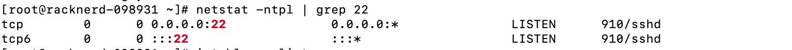

发现22端口是开放的，又查看了一下`iptables`的策略: `iptables --list`

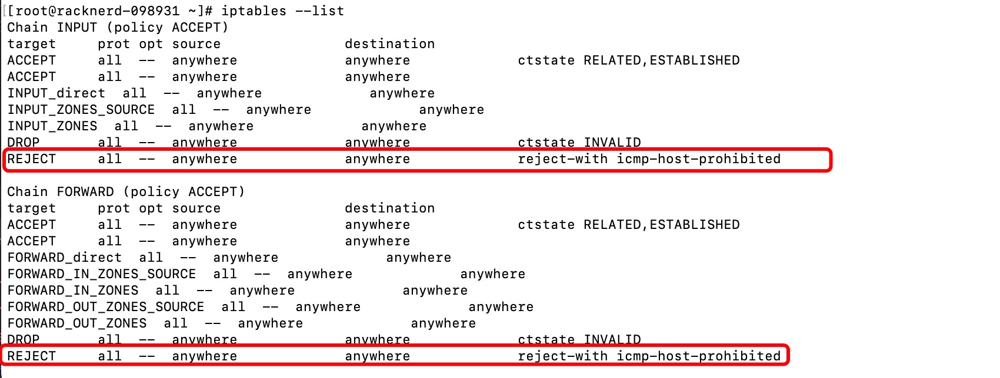

看到这些reject还以为终于找到方向，其实在错误的方向越走越远，在stackoverflow看到说可以自己编辑ssh的访问权限，可能是ip被禁了：

允许所有主机访问ssh：`vi /etc/hosts.allow`

`sshd: all`

查看一下有没有ip被拉黑：` cat /etc/hosts.deny`

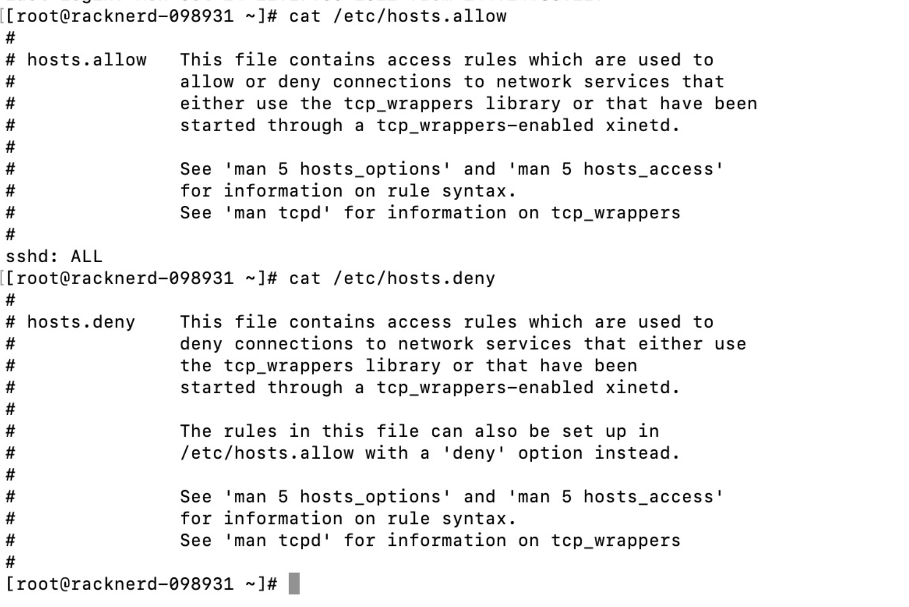

发现并没有ip被拉黑，而且已经允许所有主机连接ssh了，还是不行，突然发现好像挂了代理能连上，似乎意识到了什么。

## 查看ip连通状态

其实这时候已经意识到不对劲了，但还是抱着试试看的想法，去测试了一下自己服务器的连通状态。

路由跟踪测试：https://www.itdog.cn/traceroute/

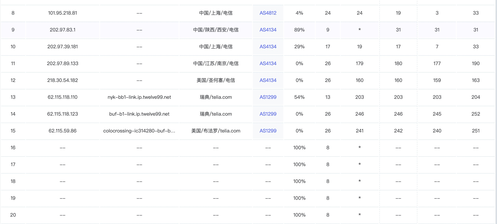

发现回程路由被拦截了，没什么可说的，被墙了。同时带来的后果就是部署在这台服务器的网站国内用户也是访问不了的。

## 换服务器IP

给racknerd发了个工单，但是换一次ip要3美元，这是最快的也是最直接的解决方案。

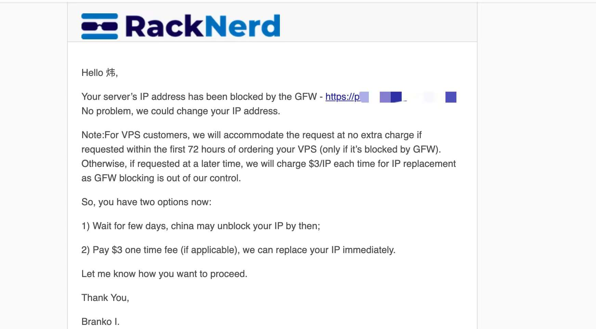

考虑了一下还是想先等等看：

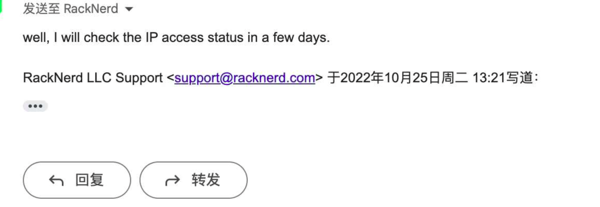

## 使用cloudflare CDN加速

另外一种平民解决方案就是使用cloudflare的CDN给国内做一层加速，这样国内访客就能正常访问你的网站了。

去注册cloudflare账号，选择free计划，然后添加你的站点：https://www.cloudflare.com/zh-cn/

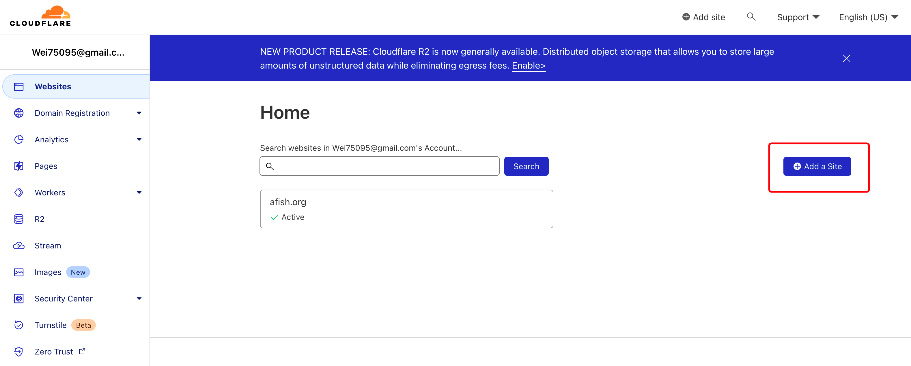

点进你的站点，进dns面板，cloudflare会自动添加你的dns解析记录，同时会提供给你两个dns服务器，将你域名的服务器换成cloudflare提供给你的这两个：

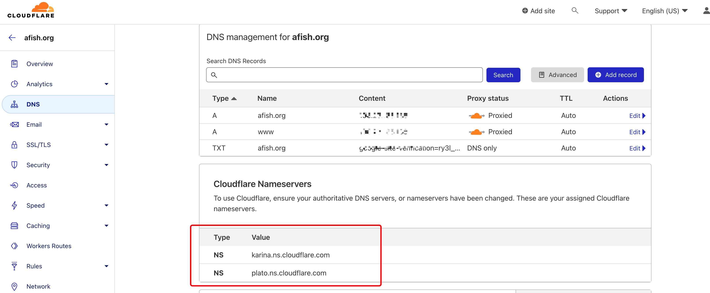

### 以namesilo为例

进入[域名管理页面](https://www.namesilo.com/account_domains.php)，选择`change nameserver`:

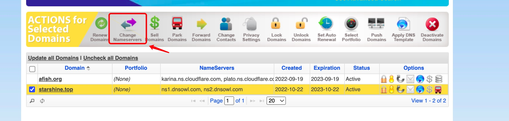

删掉原来的NameServer，填上cloudflare分配给你的：

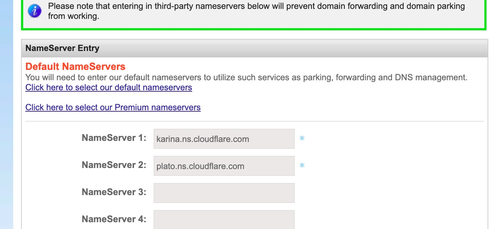

更换dns服务器解析需要一段时间，好了的话cloudflare会给你发一封激活成功的邮件。

这段时间cloudflare的域名服务暂时用不了：

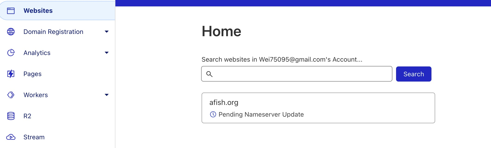

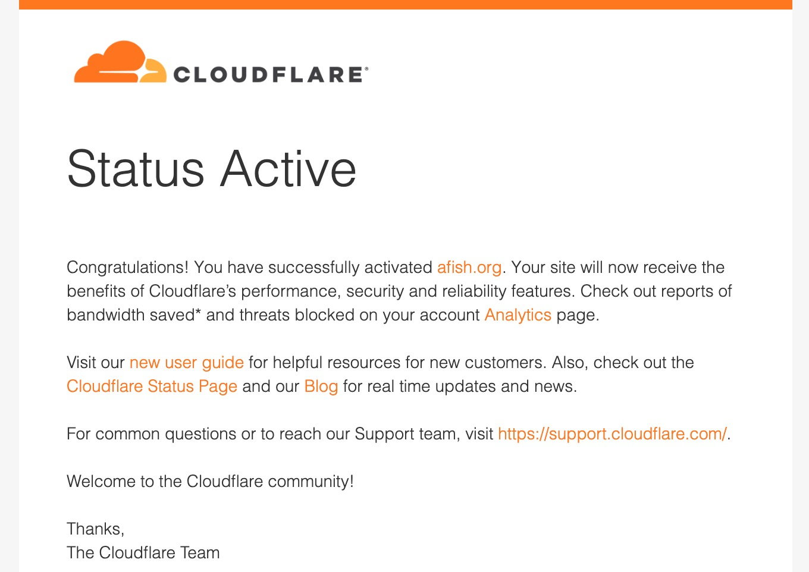

去cloudflare官网看域名已经是激活状态：

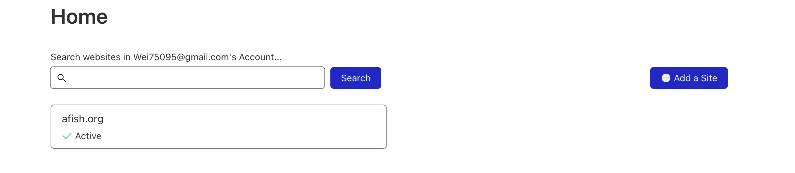

如果你需要https访问，你的域名需要已经签发ssl证书：[给你的站点添加https访问支持](https://www.afish.org/2022/10/18/add-https-support/)

然后去SSL/TLS面板选择full模式：

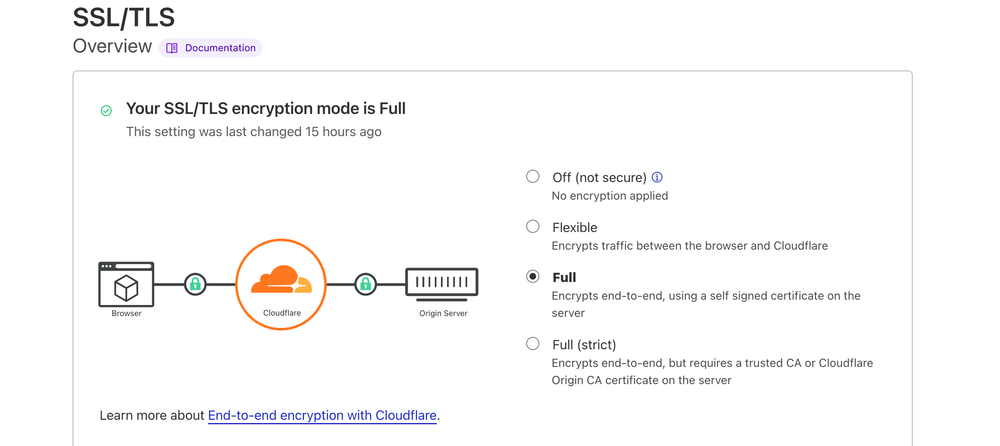

- Off：关闭，浏览器到cloudflare不加密
- FLexable：灵活的模式，浏览器到clouflare的过程加密访问
- Full：浏览器到cloudflare，cloudflare到服务器全程加密，不验证证书
- Full（strict）严格模式，浏览器到cloudflare，cloudflare到服务器全程加密，验证证书有效性

设置自动重写https以及强制https访问：[https边缘证书设置](https://dash.cloudflare.com/4b7fb1b1f145c8018dccd717cb42f5af/afish.org/ssl-tls/edge-certificates)

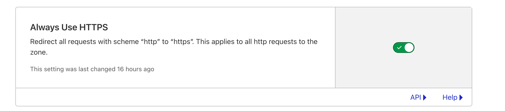

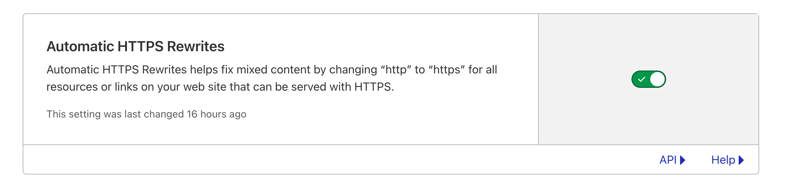

注意：如果同时选择了Full（strict）和强制https访问（Always Use HTTPS），而你服务器的证书是免费的例如是由[Let’s Encrypt](https://letsencrypt.org/)签发的就会触发SSL 526错误。

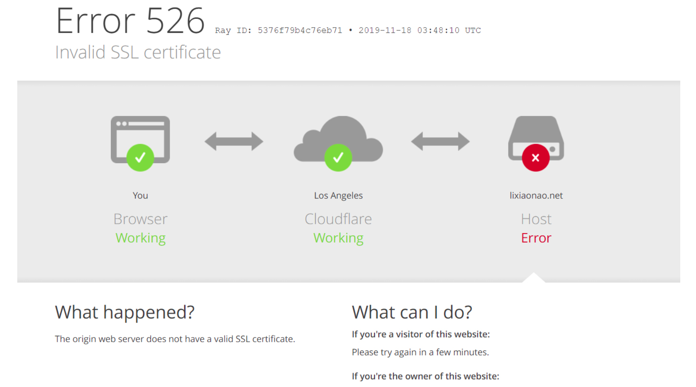

换成Full模式就好了。
