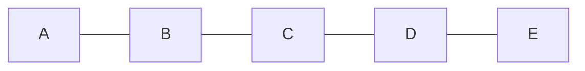
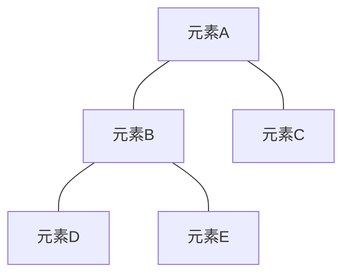
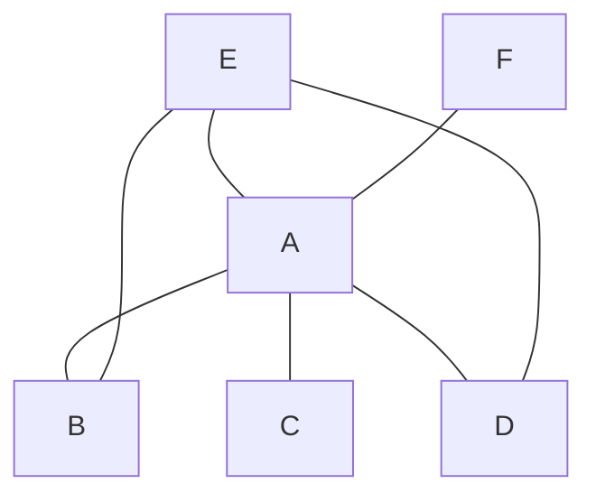
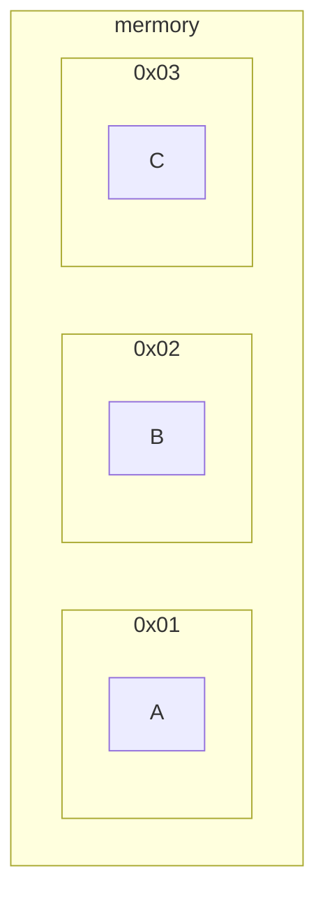
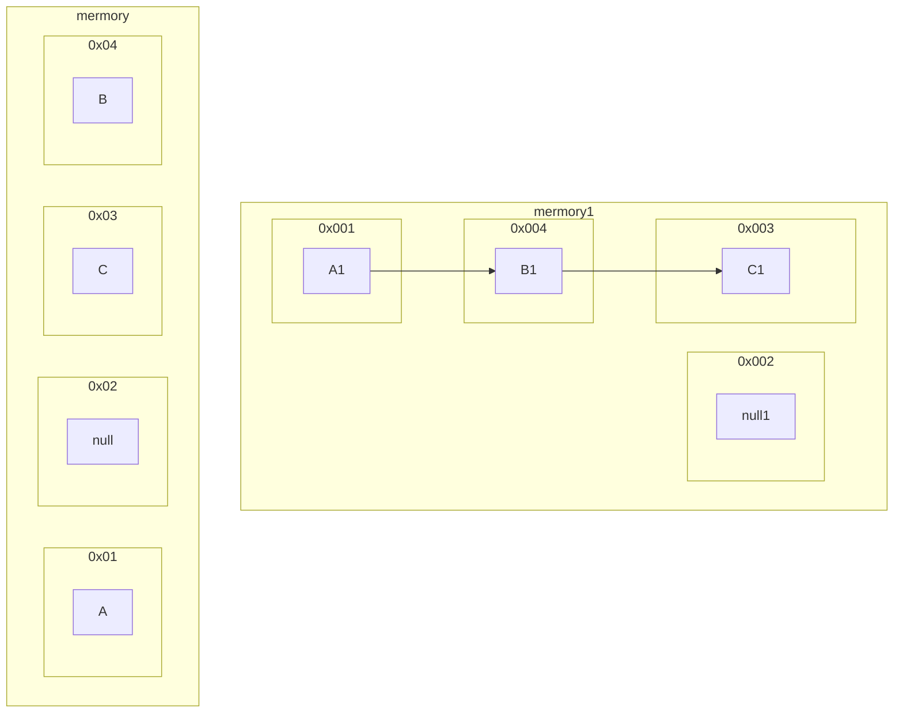

数据结构是表示相互之间存在一种或者多种特定关系的数据元素的集合。

## 数据对象

数据对象是具有相同性质的数据元素的集合，数据元素是数据对象的子集，即数据元素包含于数据对象。

### 数据元素

多个数据项的总和称之为一个数据元素。数据项是某个数据元素的具体描述。

数据结构1组

- 组员 1
  - 姓名
  - 性别
  - 年龄
- 组员 2
  - 姓名
  - 性别
  - 年龄
- 组员 3
  - 姓名
  - 性别
  - 年龄

以上结构中，`组员1`,`组员2`,`组员3`为三个数据元素，而每个数据元素具有相同的数据项`姓名`,`性别`,`年龄`，这三个数据项组成了一个数据元素。有点类似于对象的概念，数据元素是一个对象，里面的各个数据项是对象的属性。而恰好这三个数据元素具有相同性质，都是在描述某个人的`姓名`,`性别`,`年龄`，所以，这三个数据元素可以组成一个数据对象。`数据结构1组`就是包含了这几个数据元素的数据对象，数据对象中的数据元素都具有相同性质。

如果每个数据元素之间都具有某种关系，就把这种关系叫做数据结构。

数据结构1组

- top1 组员 1
  - 姓名
  - 性别
  - 年龄
- top2 组员 2
  - 姓名
  - 性别
  - 年龄
- top3 组员 3
  - 姓名
  - 性别
  - 年龄

以上每个数据元素之间线性相连，具有数据结构。

而单独的一个数据元素不具有数据结构。

组员 4

- 姓名
- 性别
- 年龄

## 逻辑结构

数据元素之间具有四种逻辑结构表示各个元素之间的逻辑关系 。

- 集合结构
- 线性结构
- 树形结构
- 图结构

### 集合结构



flowchart LR
		subgraph 集合
		 			数据元素A
		 			数据元素B
		 			数据元素C
		end



每一个数据元素都只是集合的子集，同属于一个集合，再无其他关系。

### 线性结构

所有数据元素之间线性相连。

首位元素A只有一个后继。

末尾元素E只有一个前趋。

中间的所有元素都有且只有一个前趋和后继。

### 树形结构

树形结构是一对多的关系，一个数据元素可以对应多个数据元素，与多个数据元素产生联系。

### 图结构

图结构是一种多对多的关系，每个数据元素都可以与多个数据元素产生联系。

## 物理结构

如何在计算机内部表示数据元素之间的物理存储关系。（存储结构）

- 顺序存储
- 链式存储
- 索引存储
- 散列存储

### 顺序存储

各个数据元素之间顺序排列，紧密相连，存储在连续的内存单元里面。是一种非常占用存储空间的方式。

`0x01`,`0x02`,`0x03`是内存中顺序相连的内存单元地址，顺序存储结构需要的正是这样连续的单元地址，所以很不方便且一定情况下更占用内存空间。

### 链式存储

链式存储结构在内存单元中使用指针的方式表示数据元素之间的关系。

左边的图是数据元素在内存单元中存储的位置，内存单元中`0x01`,`0x02`,`0x03`,`0x04`,相应存放`A`,`null`,`C`,`B`。

而右边的图是表示各个数据元素之间的逻辑关系，用指针表示，右图的`0x001`,`0x002`,`0x003`,`0x004`内存单元对应左图`0x01`,`0x02`,`0x03`,`0x04`。而`A1`,`null1`,`C1`,`B1`,对应`A`,`null`,`C`,`B`。

用指针表示为：`A(A1)`指向`B(B1)`的内存地址`0x04(0x004)`,`B(B1)`指向`C(C1)`的内存地址`0x03(0x003)`,可以看到，数据元素离散的存放在不相邻的内存单元中，用指针指向下一数据元素的内存地址来表示各个数据元素之间的先后关系。

### 索引存储

索引存储是通过索引表中的关键字与内存地址之间的映射关系，来表示数据元素的存储位置。关键字唯一标识出一个数据元素，类似于数据库的[主键约束(primary key)](https://www.runoob.com/sql/sql-primarykey.html)。索引存储结构的数据元素也可以离散分布。

| 索引表 |      | 内存数据表 |          |
| ------ | ---- | ---------- | -------- |
| 关键字 | 地址 | 地址       | 数据元素 |
| a1     | 0x01 | 0x01       | A        |
| b1     | 0x03 | 0x02       | C        |
| c1     | 0x02 | 0x03       | B        |

可以看到，在内存中的数据元素并不是按照顺序存放的，通过关键字`a1`对应的内存地址`0x01`找到数据元素A，通过关键字`b1`对应的内存地址`0x03`找到数据元素B，索引存储结构中其他数据元素皆是通过这种索引方式访问。

### 散列存储

散列存储是一种哈希(hash)存储结构。
