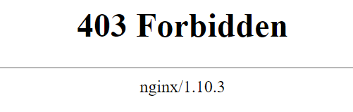

前几天刚搭好博客的时候，默认的请求都是通过http发起的，以http发起的请求由于没有ssl加密协议，浏览器会提示Not Secure，这对于一个强迫症且比较追求完美主义的人来说是不能忍的(几乎所有从事程序开发的人都有一点这个毛病🤔️)。所以我申请了ssl证书且用nginx进行代理，但是我发现，虽然https://www.afish.org 这个网址是可以进去的，但是以afish.org或者www.afish.org 发起的请求默认走的还是http，所以我单独在nginx配置了一下对于https的强制转发。

## <font color="\#4682B4">什么是https</font>

[HTTPS（超文本传输安全协议）是一种互联网通信协议，可保护用户计算机与网站之间传输的数据的完整性和机密性。用户在访问网站时都希望获得安全私密的在线体验。因此，无论您的网站提供什么内容，我们都建议您采用 HTTPS 来保护用户与您网站之间的连接。](https://developers.google.com/search/docs/advanced/security/https?hl=zh-cn)

以上就是Google官方文档对于https的解释，简单来说就是你的网站使用了https会更安全，数据和表单不会轻易泄漏，所以现在基本上大部分网址用的都是https连接了，而且Google也在倡议这种行为。

## <font color="\#4682B4">nginx配置</font>

#### <font color="\#FF3030">注意事项: </font>nginx的配置文件

安装完nginx之后会在/etc/nginx生成nginx.conf，这是nginx的默认配置文件，nginx的配置文件还可以通过include的方式生效，比如在/etc/nginx/nginx.conf文件内增加这一句:

```bash
include /etc/nginx/conf.d/*.conf	#将/etc/nginx/conf.d/目录内所有conf文件插入
```

所以，要搞清楚，自己真正要编辑的是哪个文件，我就是刚开始重复编辑了nginx的默认文件，导致始终没有达到正确效果，其实执行重启nginx命令的时候也提示我了，因为我ngnix.conf有重复配置，不过我没有理会，以下是提示信息：

```bash
nginx -s reload
# 重新加载nginx
nginx: [warn] conflicting server name "www.afish.org" on 0.0.0.0:80, ignored
nginx: [warn] conflicting server name "www.afish.org" on 0.0.0.0:80, ignored
nginx: [warn] conflicting server name "www.afish.org" on [::]:80, ignored
#有三个监听80端口的www.afish.org被忽略了，但是这些配置文件是存在的，nginx实际上做转发的时候不知道要用哪一个，所以就随机来了？

#把配置文件中多余的配置项删除或者注释，保证server里面只有一个监听
```

接下来去修改nginx的配置文件

<font color="red">不要去修改自己新建的配置文件</font>，比如/etc/nginx/conf.d/blog.conf

这个文件是用来发布博客的，应该保持以下内容：

```bash
server {
    listen    80 default_server;
    listen    [::] default_server;
    server_name    afish.org;
    root    /root/www/hexo;
}
```

###nginx最终配置看这里

我们去修改/etc/nginx/nginx.conf这个文件，在空白合法位置(<font color="red">不在server的括号里面</font>)添加以下内容：

```bash
    server {
    
    if ($host = www.afish.org) {
        return 301 https://$host$request_uri;
    } # managed by Certbot

        listen       80;
        listen       [::]:80;
        server_name   www.afish.org;
    return 404; # managed by Certbot


}
#将接收到的http请求以https方式返回
```

退出文件，重新加载nginx：

```bash
nginx -s reload
```

但是现在突然发现站点进不去了？？报错403 forbidden



造成403 error的原因有很多，可能是脚本文件没有执行权限，也可能是以http方式访问了需要ssl连接的网址，还可能是访问请求被防火墙拒绝了。

## <font color="\#4682B4">Linux防火墙放行https</font>

由于Linux的防火墙机制复杂，我们先来对症下药。

我们先用netstat命令看看80和443端口有没有被监听到：

```bash
netstat -anp 
```

返回如下:

```bash
Active Internet connections (servers and established)
Proto Recv-Q Send-Q Local Address           Foreign Address         State       PID/Program name    
tcp        0      0 0.0.0.0:80              0.0.0.0:*               LISTEN      20194/nginx: master 
tcp        0      0 0.0.0.0:22              0.0.0.0:*               LISTEN      833/sshd            
tcp        0      0 0.0.0.0:443             0.0.0.0:*               LISTEN      20194/nginx: master 
```


发现端口是已经被监听了的，那就是其他问题

我们再来看看防火墙对于https的规则，以centos 7为例：

```bash
firewall-cmd --query-service https 
```

```bash
no
#返回了no，说明防火墙是没有对https放行的，然后我们已经把请求全部转发到了https，所以现在即使输入http来访问也是进不去的
```


使用以下命令对https永久放行：

```bash
firewall-cmd --add-service=https --permanent
```

重新加载防火墙：

```bash
firewall-cmd --reload
```

重新加载ngnix：

```bash
nginx -s reload
```

现在可以正常用https访问自己的站点啦～
