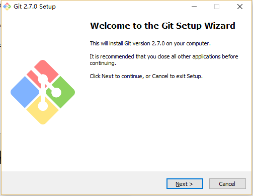
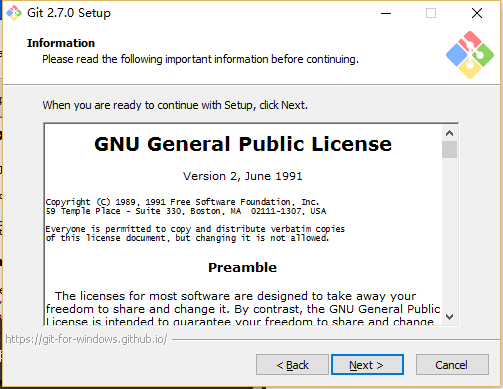
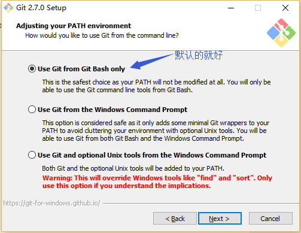
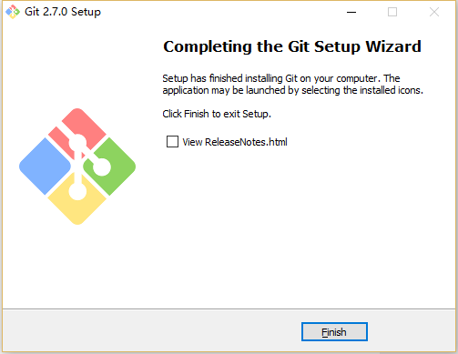
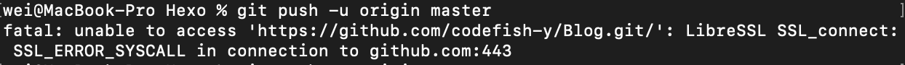

学Hadoop的时候通过`namenode`和`secondnamenode`知道了，重要的东西要做好备份，有时候，一份备份是不够的。

我的博客是已经从本地部署到服务器了，但那只是文章，整个项目在我本地只有一份，这显然是不保险的，那就让GitHub再帮我保管一份吧。

## 新建仓库

在GitHub新建一个用于保存稍后提交的文件的仓库。

在底下找到`Create repository`创建此仓库

## 安装git

### windows

git官方下载地址：http://git-scm.com/download/

省流小助手：`除安装路径外其他一路默认下一步即可`

下载好之后开始安装，欢迎界面，下一步。

选择安装路径，千万别选带中文的路径，这是作为一个开发者基本的常识。

选择安装组件，按默认的来就好了。

- 图标组件(Addition icons) : 选择是否创建快速启动栏图标 或者 是否创建桌面快捷方式;
- 桌面浏览(Windows Explorer integration) : 浏览源码的方法, 单独的上下文浏览 只使用bash 或者 只用Git GUI工具; 高级的上下文浏览方法 使用git-cheetah plugin插件;
- 关联配置文件(Associate .git*) : 是否关联git配置文件, 该配置文件主要显示文本编辑器的样式;
- 关联shell脚本文件(Associate .sh) : 是否关联Bash命令行执行的脚本文件;
- 使用TrueType编码 : 在命令行中是否使用TruthType编码, 该编码是微软和苹果公司制定的通用编码;

设置开始菜单中快捷方式的目录名称，默认就好，下一步吧

设置环境变量 : 选择使用什么样的命令行工具, 一般情况下我们默认使用Git Bash即可, 默认选择;

- Git自带 : 使用Git自带的Git Bash命令行工具;
- 系统自带CMD : 使用Windows系统的命令行工具;
- 二者都有 : 上面二者同时配置, 但是注意, 这样会将windows中的find.exe 和 sort.exe工具覆盖, 如果不懂这些尽量不要选择;

选择换行格式 ，依然是默认就好。

- 检查出windows格式转换为unix格式 : 将windows格式的换行转为unix格式的换行在进行提交;
- 检查出原来格式转为unix格式 : 不管什么格式的, 一律转为unix格式的换行在进行提交;
- 不进行格式转换 : 不进行转换, 检查出什么, 就提交什么;

选择终端模拟器，依然默认就好

- 使用MinTTY，就是在Windows开了一个简单模拟Linux命令环境的窗口Git Bash
- 使用windows的系统的命令行程序cmd.exe

选择默认就好，不用文件系统缓存

安装中……

git安装成功。

### macOS

macOS下载git安装程序，一路下一步即可：[安装程序](http://sourceforge.net/projects/git-osx-installer/)

## 提交到仓库

### 初始化

打开终端切换到你项目的根目录

执行：`git init`

创建了一个空的git仓库

### 添加文件

输入`git add .`将所有文件添加到仓库

### 提交到git仓库

输入`git commit -m "首次提交"`将文件提交到git仓库

### 告诉git你是谁

输入`git config –global user.name “你的 github 用户名”`

输入`git config –global user.email “xxx@xxx.com(你的 github 邮箱)”`

### 关联GitHub仓库

复制你仓库的git地址

输入`git remote add origin https://github.com/codefish-y/Blog.git`,仓库地址记得换成自己的。

### 推送到GitHub仓库

如图所示，由于GitHub在`August 13, 2021`关闭了以密码作为凭证的方式，得换成token验证。

#### 配置token

在GitHub的`Settings-Developer setting-Personal access tokens-Generate new token`,选择classic。

设置token名和有效期，我这里因为是自己用就选择了不过期，根据自己个人来选择。

选择要授予此`令牌token`的`范围(scopes)`或`权限`。

- 要使用`token`从命令行访问仓库，请选择`repo`。
- 要使用`token`从命令行删除仓库，请选择`delete_repo`
- 其他根据需要进行勾选

选择好了之后生成令牌，复制到其他地方备份，刷新就看不到了。

将令牌加到远程仓库链接中，打开你本地项目的`.git/config`

令牌后面加一个`@`

输入`git push -u origin master   `将本地git仓库推送到GitHub仓库(输入GitHub用户名和密码)

GitHub上已经能看到推送的文件

一些命令

- git add -A 提交所有变化
- git add -u 提交被修改 (modified) 和被删除 (deleted) 文件，不包括新文件 (new)
- git add . 提交新文件 (new) 和被修改 (modified) 文件，不包括被删除 (deleted) 文件
- git commit -m "提交增加注释"
- git push -u origin master 以master分支推送文件
