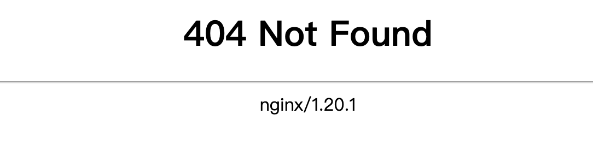
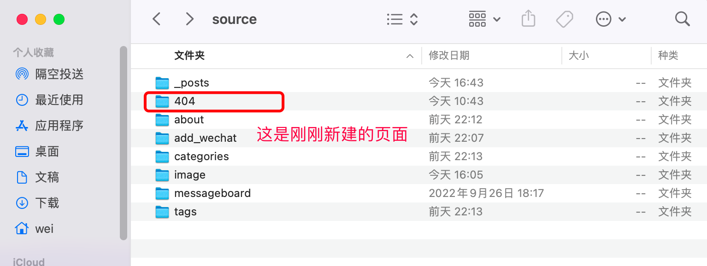
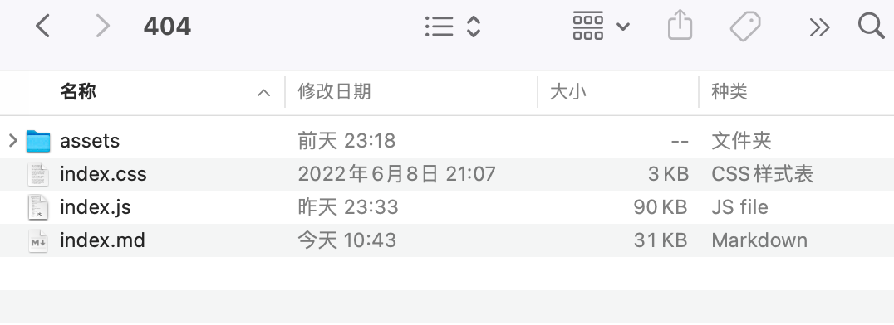
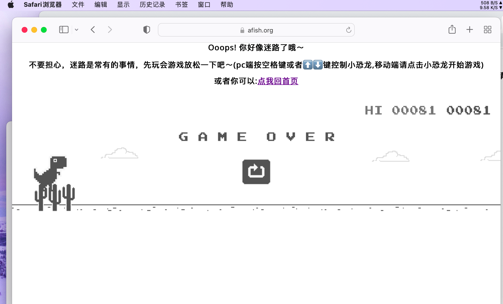

`404 Not Found`这是一个网页资源未找到的报错提示。

一般情况下，这个页面长这个样子：



## 引言

如果404页面只有一个报错信息，再无其他内容，且不说这个报错信息普通互联网用户是否能看懂，怕是很多人看到这个页面就会直接把整个网页关掉了，毕竟没接触过互联网的人把这个报错信息认为是网站崩溃也是情有可原。

那我们适当的给用户做一些引导，文字性的或者图片都可以，比如放置一个回到站点首页的入口，这样有很大可能会留住访客，点击入口后访客可以回到站点首页继续浏览其他内容。

当然，我们还可以做一些有意思的修改，比如把这个页面做成一个小游戏。Google的 offline page就是一个不错的选择，你也可以部署成自己喜欢的其他样式，我第一次看这个小恐龙游戏就觉得很有意思，所以我选择了它。

GitHub上有人把这个小游戏的源码给放出来了：[离线小恐龙游戏](https://github.com/wayou/t-rex-runner)，这个项目里面还放了其他的花样玩法，可以自己进行选择。我下载的就是Google原生的offline page。

项目结构如下：

t-rex-runner

- assets
- index.css
- index.html
- index.js

项目中包含了一个层叠样式表文件和一个javascript脚本文件，剩下的就是网页入口，至于assets目录里面，放置的是这个小游戏运行所需要加载的图片文件。

## 部署

### 初始化

在站点根目录打开终端输入以下命令新建一个页面：

```shell
hexo new page 404
```



将js和css文件以及assets资源文件夹放进这个目录：



前往站点的`/public`目录,将已存在的404网页文件删除

### 配置相关

先关闭主题自带的404页面，打开`_config.butterfly.yml`,将默认的404页面关闭：

```yaml
# A simple 404 page
error_404:
  enable: false
  subtitle: '你进入了一片荒芜之地,点左上角可回到安全地带！'
  background: https://i.loli.net/2020/05/19/aKOcLiyPl2JQdFD.png

```

打开404目录下的`index.md`,在`front-matter`区域设置以下变量：

```yaml
title: 404
# 关闭布局
layout: false
# 关闭评论
comments: false
# 生成404页面
permalink: /404
```

然后将项目中的`index.html`里面内容全部复制到`index.md`，你可以适当更改一下h1中的提示内容，比如：

```yaml
<div id="messageBox" class="sendmessage">
      <h1 style="text-align: center;font-family: 'Open Sans', sans-serif;font-size: 16px">Ooops! 你好像迷路了哦～</h1>
      <h1 style="text-align: center;font-family: 'Open Sans', sans-serif;font-size: 16px">不要担心，迷路是常有的事情，先玩会游戏放松一下吧～(pc端按空格键或者⬆️⬇️键控制小恐龙,移动端请点击小恐龙开始游戏)</h1>
      <h1 style="text-align: center;font-family: 'Open Sans', sans-serif;font-size: 16px">或者你可以:<a href = "https://www.afish.org">点我回首页</a></h1>
      </div>
```

### 重新加载资源

由于现在目录结构与原项目是不一样的，所以需要重新指定资源加载的路径。

#### 脚本文件

在`index.md`中更改脚本文件的引用路径：

```yaml
# css
<link rel="stylesheet" href="../404/index.css">
# js
<script src="../404/index.js"></script>
```

#### 图片资源

```yaml


```

## 最终效果

运行`hexo s`查看效果，访问http://localhost:4000/404



### 注意

如果还是显示nginx的默认404页面，去服务器编辑nginx配置文件指定一下404页面的路径：

`vi /etc/nginx/nginx.conf`

添加以下内容：

```nginx
        error_page 404 /404.html;
        location = /40x.html {
        }

```

重新加载nginx：

`nginx -s reload`
