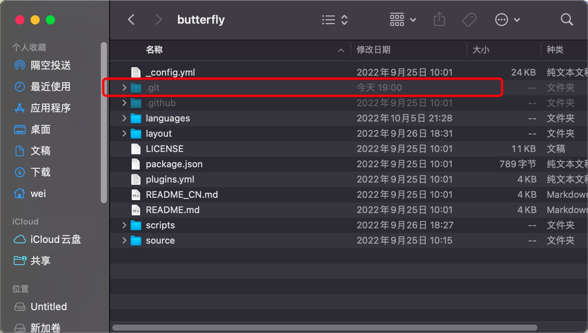
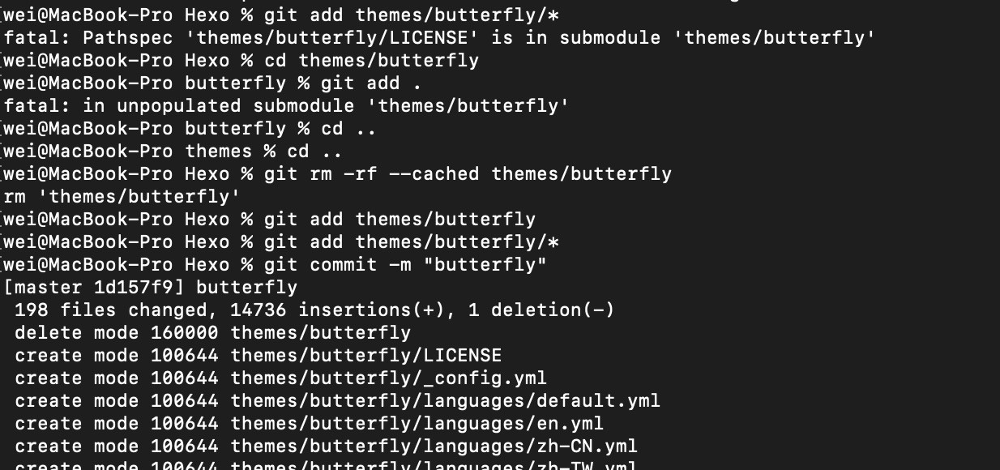
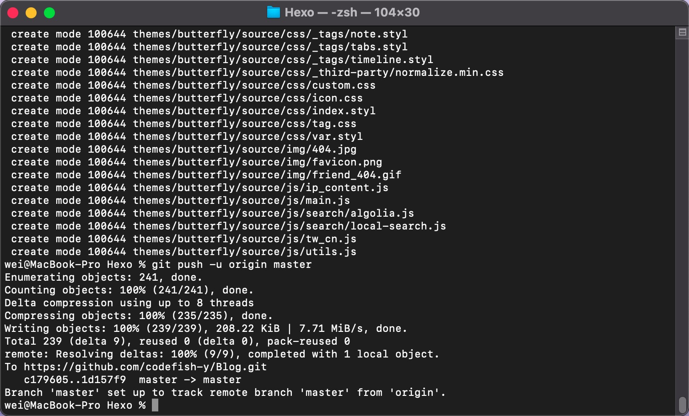
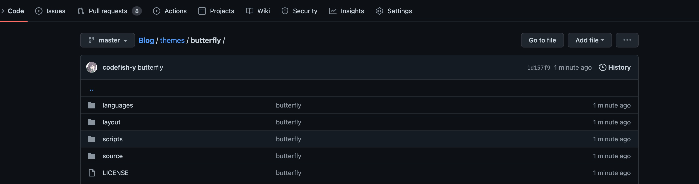

---

title: git_Pathspec_'xxx'_is_in_submodule
date: 2022-10-24 08:20:17
tags: [git,github,bug]
categories: [技术分享,bug解决]
cover: /image/pathsepc_is_in_submodule/98c44d00-69a6-11e9-9a1c-a6265bc3bcd9.png
---

昨天想把整个博客本地项目上传到GitHub的时候，发现一个问题，`themes/butterfly`里面的内容无法上传，会生成一个空文件夹，但是里面没有内容。

## 原因

这是因为这个主题文件是从GitHub克隆下来的，本身就自带一个.git文件夹，这样在提交的时候会生成一个子git项目, 项目就叫做git submodule结构, 外部无法对子模块进行控制，所以无法将里面的内容提交到仓库。

报错`Pathspec 'xxx' is in submodule`or`fatal: in unpopulated submodule XXX`,都是因为外部git和主题git冲突导致的。

## 解决

我们不需要主题里面的git文件夹，去把它删掉。

而我们之前已经提交了一次或反复多次提交了文件，仓库里有一个空的themes/butterfly，把仓库的空文件删掉重新添加：

​		删除：`git rm -rf --cached themes/butterfly `

​		添加：`git add themes/butterfly/*     `

​		提交到仓库：`git commit -m "butterfly"`

这时候可以顺利将`themes/butterfly`里面的文件提交到仓库。

如果遇到`error: path 'themes/butterfly' is unmerged`错误：

尝试

​	`git reset themes/butterfly`

​	`git checkout themes/butterfly`

通过master分支推送到GitHub：`git push -u origin master`

推送成功，去GitHub查看发现已经成功添加进来：

