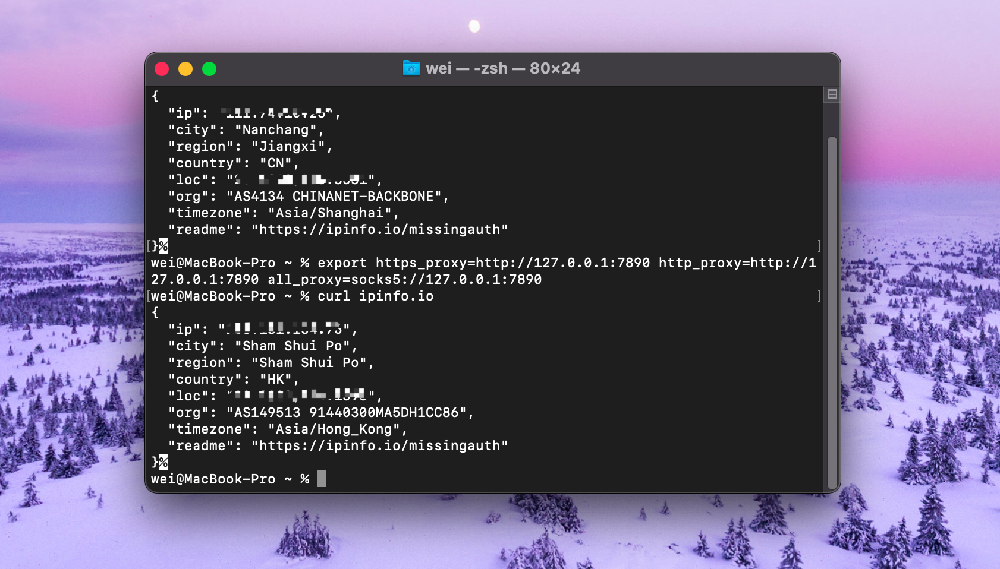

macOS自带的的终端是非常好用的，可以直接建立ssh连接，支持多种shell，Catalina之后默认zsh，完全不需要其他终端软件代替，而且还可以自定义主题和字体，不过我觉得默认的Basic就很好看了，不需要那么花哨。

连接远程服务器只需：`ssh user@id_address`

然而我的服务器由于不可抗力原因被ban了，国内正常是访问不了的，本来我以为开了代理就可以，结果试了一下，就算是全局都不行，terminal显然没有被代理到。

那我们手动给终端加一个临时的代理。先看看现在终端认为我们的ip是什么：

`curl ipinfo.io`

可以看到，回显信息表示我们在江西南昌。

## 指配临时代理

给终端指定一个临时代理：

`export https_proxy=http://127.0.0.1:7890 http_proxy=http://127.0.0.1:7890 all_proxy=socks5://127.0.0.1:7890`

这里的端口号由你的代理客户端监听的实际端口决定，比如shadowsocks默认的socks5端口是1080。

再次查看ip：`curl ipinfo.io`

这回显示我们是在香港，大多数人在这一步就已经可以正常连接服务器了。但是我发现，我这里虽然curl的确被代理了，但是ssh似乎比较顽固，依然连接不上我的服务器。

## Clash增强模式

然后我发现Clash有个增强模式。

开启增强模式后，服务器已经能够正常通过ssh连接，不得不说，增强模式的确很强。

文章也能正常发布到服务器。

