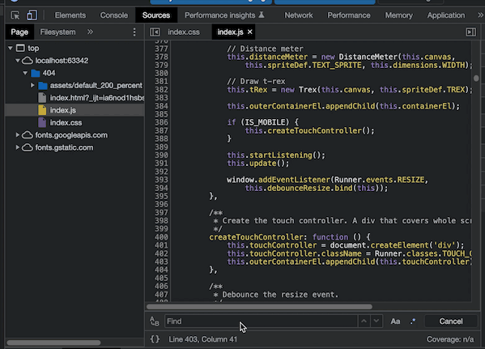

用手机端测试新部署的404页面的时候，发现了一个bug，无法点击屏幕上的超链接，通过一阵摸索和剖析源码，研究出一种解决思路。

`如何自定义404页面？`请看此文：[Hexo|Butterfly 自定义你的404页面](https://www.afish.org/2022/10/21/modify-404-page/)

## 问题出现原因

这个404页面的小游戏设置了事件监听器，当触发了监听的`event`才会开始游戏，一般点击事件都是监听`click`,但是移动端是个特殊的存在，他的点击事件是由通过触摸屏幕来控制的。

当点击屏幕时，会依次触发`touchstart→touchmove→touchend`,移动端的点击事件就是`手指触碰屏幕-手指离开屏幕`,手指的放下和拿起是一次完整的点击事件，如果中途移动了，那就是另外的滑动事件了，这里不做讨论。但是由于触摸事件的特性，出现了类似这样的bug，无论怎么点击超链接触发的都是控制小恐龙跳动，仿佛根本没点到超链接的文字。

<center></center>

## 解决思路

我们先去看看到底是哪些代码控制了移动端的点击事件，如果识别到当前是用移动端访问，会执行哪些操作呢？



通过查看源代码发现，当识别到是使用移动端访问，初始化了一个触摸控制器。

```javascript
if (IS_MOBILE) {
                this.createTouchController();
            }
```

那么这个触摸控制器会干些什么呢？

```javascript
createTouchController: function () {
            this.touchController = document.createElement('div');
            this.touchController.className = Runner.classes.TOUCH_CONTROLLER;
            this.outerContainerEl.appendChild(this.touchController);
        }
```

我们发现，`createTouchController`通过函数创建了一个`touchController`然后借助`appendChild`函数覆盖了整个dom。还记得前面说的吗，超链接仿佛被什么挡住了，无法点击。使用过Photoshop的人应该知道一种叫做图层的概念，这种情况就像是超链接的图层被这个覆盖了整个dom的`touchController`给遮住了，所以点击不到。

既然知道问题发生在什么地方，我们就好解决了，通过查找源码发现，`outerContainerEl`追加的子节点应用到了整个dom，但是还有一个`containerEl`只会应用到游戏区域，将touch事件限制在指定的游戏区域，我们对源码进行一些修改：

```javascript
createTouchController: function () {
            this.touchController = document.createElement('div');
            this.touchController.className = Runner.classes.TOUCH_CONTROLLER;
 /* 将触摸事件限定在指定容器内，不对其他容器造成影响*/
            this.containerEl.appendChild(this.touchController);
        }
```

至此，游戏区域的容器响应开始游戏的touch事件，而其他地方响应正常的click事件。互不干扰，超链接也可以正常点击进入。

本文只为解决这个bug，不对touch和click事件的底层原理进行探究。
