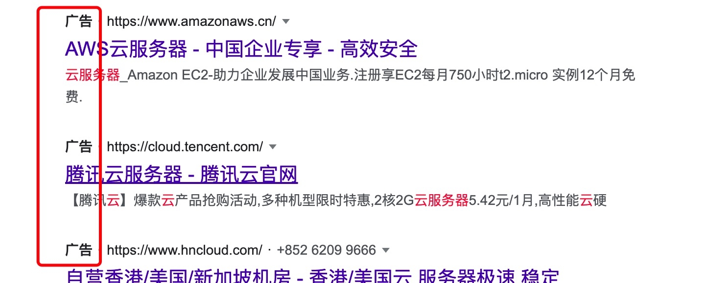
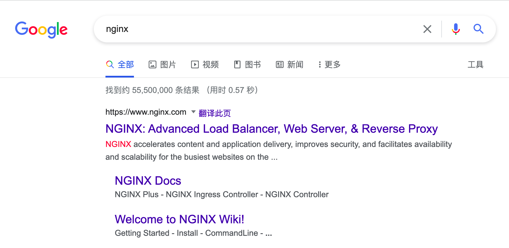

## 背景与原因

2010年3月23日，Google发布一篇 [“关于谷歌中国的最新声明”](https://www.google.com/press/new-approach-to-china/update.html) ，文中声称受到网络黑客攻击，且因内地的一些限制，无法再对google.cn的内容进行自我审查。以下为部分原文：

*<u>这些攻击以及它们所暴露的网络审查问题，加上去年以来中国进一步限制网络言论自由，包括 对FaceBook、Twitter、YouTube、Google Docs 和 Blogger 等网站的持续屏蔽，使我们做出结论：我们不能继续在Google.cn搜索结果上进行自我审查。</u>*

*<u>从今天早上开始，我们已停止了在Google.cn搜索服务上的自我审查，包括 Google Search （网页搜索）、Google News（资讯搜索）和Google Images （图片搜索）。 访问 Google.cn 的用 户从现在开始将被指向Google.com.hk，在这个域名上，我们将提供未经审查的简体中文搜索结果，这些为中国大陆用户设计的服务将通过我们在香港的服务器实现。香港地区的用户还将继续通过Google.com.hk获得跟现在一样的、未经审查的繁体中文搜索服务。在我们进行迁移的过程中，由于香港服务器负荷的增加以及这些变化的复杂程度，用户可能会发现搜索速度变慢，或发现某些产品暂时不能访问。*</u>

自2010年三月起，由于中国的内容审查制度以及长城防火墙对域名的污染，中国内地的用户已经无法访问包括 [Facebook](https://www.facebook.com)(脸书) [YouTube](https://www.youtube.com)(油管) [stackoverflow](https://www.stackoverflow.com)(技术论坛) 以及 [Twitter](https://www.twitter.com)(推特) 在内的众多网站，当时Google所留存的服务只有[Google地图](https://www.google.com/maps)与[Google翻译](https://translate.google.com/)，而Google地图也在2020年2月3日关闭了cn域名的服务，现在，Google翻译也不提供cn的服务，Google跳转了一个页面叫用户收藏香港的域名，但是实际上，在内地是访问不了这个域名的。可以说，现在Google的所有服务在中国内地都已经用不了了。

## 带来的影响

说是影响可能有点危言耸听了，毕竟对于某些人来说，他可能从来没有用过Google search，甚至根本就不知道Google是什么东西（这本身也是一种影响）。但是实际上这场事件给中国的互联网生态带来了无比深远的变化。

#### 搜索引擎

我记得我初中时政治老师在黑板上写过一句话：“国内事问度娘，国外事问谷哥”，十几年前的互联网生态是多么美好啊，那时候百度还能和Google分庭抗争，至少那时候的百度还没那么猖狂，还遵守着一家互联网科技公司该有的底线。

但是现在，我们每个人每天打开搜索引擎的频率是相当高的，特别是你急于获取知识的时候。但是现在我只想说一句：寻医问药莫上百度，治病救人另作它求。

还有搜索软件下载时百度推荐的那些广告网站，往往计算机自动安装应用，弹出广告弹窗，系统垃圾过多，运行缓慢等就是这些东西搞的鬼，所以，下载软件请认准软件官网！！！

##### 魏则西事件

但我不想死，我21年的奋斗和努力还没有化为光和热，

我还有梦想，我想看看这个广大的世界，

我想经历自己的一个完整的人生，成就自己的事业。

同时我是独子，我无法想像如果我现在死去，

我的父母将会怎样度过他们的晚年。

这是血淋淋的文字，这是最无力的呼救。以上这段文字，是[魏则西](https://zh.m.wikipedia.org/zh-hans/%E9%AD%8F%E5%88%99%E8%A5%BF%E4%BA%8B%E4%BB%B6)的求救视频中的截取。

魏则西（1994年2月18日－2016年4月12日）是陕西咸阳人，家中独子，生前为[西安电子科技大学](https://zh.m.wikipedia.org/wiki/西安电子科技大学)计算机系学生。2014年，大二时的魏则西被发现患有晚期[滑膜肉瘤](https://zh.m.wikipedia.org/wiki/滑膜肉瘤)。在采取各种化疗、放疗的方法后，魏则西家庭通过百度推荐的[武警北京市总队第二医院](https://zh.m.wikipedia.org/wiki/武警北京市总队第二医院)肿瘤生物中心尝试所谓的“肿瘤生物免疫疗法”（[DC](https://zh.m.wikipedia.org/wiki/树突细胞)-[CIK](https://zh.m.wikipedia.org/wiki/细胞因子诱导的杀伤细胞)疗法），在付出大量医药费（超过人民币20万）和时间后，仍然没有效果，2016年4月12日，因病身亡。

魏则西的去世，使得百度又因为医学信息竞价、审查不严谨，遭受媒体及舆论强烈批评。百度推广在事情爆发后，声明其立即与魏则西的父亲取得联系，致以慰问和哀悼；并支持魏则西家人对“主犯”，即武警北京市总队第二医院采取法律措施。而魏则西家人则声称百度从未与其联系过，并认为“百度公司在说谎”。

百度内部公告称百度副总裁[王湛](https://zh.m.wikipedia.org/w/index.php?title=王湛_(百度人物)&action=edit&redlink=1)因“违反职业道德、损害公司利益”而被百度开除。百度失去了一个员工，魏则西失去了他自己的生命。没有人会记得魏则西，直到出现下一个魏则西。

由于Google的退出，微软的[必应](https:www.bing.com)不被大众认知，国内的搜索引擎市场被百度所垄断，一家独大。造成了一种认知偏差，人们有什么不知道的东西都只会说去 “百度一下” ，认为搜索引擎就应该用百度。但是一旦某种事物出现了垄断行为，那对用户来说是相当不利的。魏则西事件就是因为百度对于商业广告的推广行为不负责所导致的，不管你是什么公司，只要你给的钱多，你的搜索权重就越靠前，简单来说，你给的钱越多，人们在搜索相关关键词的时候就会优先看到你的广告，百度可能对广告内容以及真实性不做严格审查。

##### 广告与内容

不是说只有百度才有广告，Google的搜索结果也会有广告内容，但是Google的广告是结合关键词认为你有阅览这些广告的需求才会给你推送，而且广告标识非常醒目，在标题栏上方用黑色加粗字体显示，而百度的则是用灰色浅字体显示，与页面融为一体，不易分辨。比如用Google和百度同时搜索 “云服务器” 关键字：

| 此为Google搜索结果：                                  | 此为百度搜索结果：                                  |
| ----------------------------------------------------- | --------------------------------------------------- |
|  |  |

如果是针对专业性强的检索关键字，比如Nginx：

| Google直接给出官方文档：                                     | 至于百度....                                                 |
| ------------------------------------------------------------ | ------------------------------------------------------------ |
|  |  |

​	只需要对比一下，体验到底怎么样用户感知最明显。用Google找问题解决方案，一分钟搜索，两分钟阅读，五分钟之内解决问题，而用百度的话，你还得先从一堆广告和其他信息中找到你要的技术分享帖，然后看了几篇发现都是查重率100%的内容，甚至连标点符号都没有改。

用Google搜索的结果只要出现了stackoverflow等技术论坛的内容，那基本上都是奔着问题解决的方向走的，至于百度，某论坛的重复水贴，文章搬运，金币下载，生态已经被搞得乌烟瘴气了。

良秀不济的生态环境下埋藏的是生了锈的了利益链。

相信没有任何一个人想把大片的时间浪费在搜索引擎上，没有谁想在找到自己想要的内容前先过滤一遍广告，然后再过滤掉重复水贴。最后就算找到了答案也浪费了更长的时间，付出的时间与回报不占正比。这种白白浪费掉的时间成本换来的只是资本家的利益。所以，养成一个良好的搜索习惯，不要进百度推荐的那些广告网站，专业的事情还是交给Google来吧。

