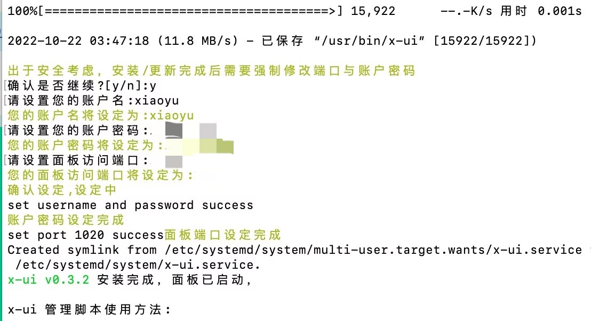
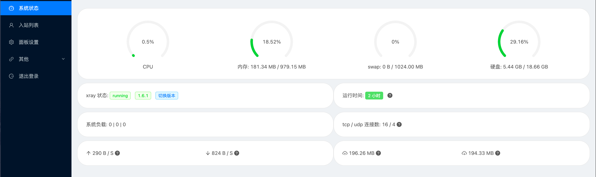
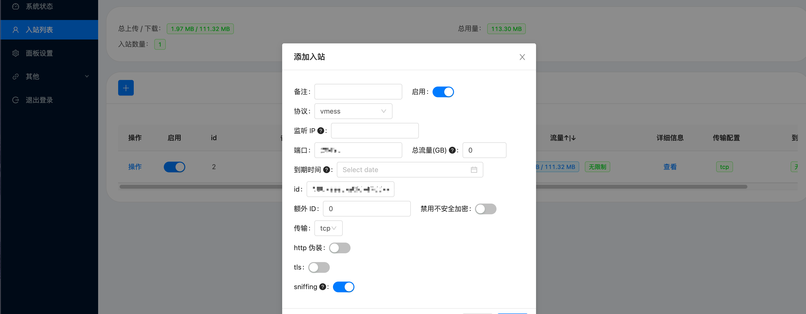

## 序

[x-ui](https://github.com/vaxilu/x-ui/)是什么？

x-ui是一款支持多协议多用户的xray面板。

Features

- 系统状态监控
- 支持多用户多协议，网页可视化操作
- 支持的协议：vmess、vless、trojan、shadowsocks、dokodemo-door、socks、http
- 支持配置更多传输配置
- 流量统计，限制流量，限制到期时间
- 可自定义 xray 配置模板
- 支持 https 访问面板（自备域名 + ssl 证书）
- 支持一键SSL证书申请且自动续签
- 更多高级配置项，详见面板

bbr是什么？

BBR 是 Google 提出的一种新型拥塞控制算法，可以使 Linux 服务器显著地提高吞吐量和减少 TCP 连接的延迟。 BBR解决了两个问题：

- 在有一定丢包率的网络链路上充分利用带宽。非常适合高延迟，高带宽的网络链路。
- 降低网络链路上的buffer占用率，从而降低延迟。非常适合慢速接入网络的用户。

## 开始部署

### x-ui面板

用ssh连接服务器，在任意目录运行该命令：

```sh
bash <(curl -Ls https://raw.githubusercontents.com/vaxilu/x-ui/master/install.sh)
```

根据提示`设置账户名和密码以及面板访问端口`：



安装完成后，使用`服务器ip或域名加上刚刚设置的端口访问面板`(使用域名访问需要添加dns记录将域名解析到服务器)：


登录进来之后会显示系统运行状态：



然后你可以在入站列表中新建节点配置信息，再点击操作以二维码或者链接分享出去就可以了。



### bbr加速

#### 安装

依次执行：

```sh
# 安装脚本
wget --no-check-certificate -O /opt/bbr.sh https://github.com/teddysun/across/raw/master/bbr.sh
```

```sh
# 安装脚本赋权
chmod 755 /opt/bbr.sh
```

```sh
# 运行安装脚本
/opt/bbr.sh
```

安装完成后，输入y确认重启服务器，然后再次使用ssh链接服务器，如果防火墙没有关闭，使用一下命令关闭防火墙：

```sh
# 关闭防火墙
systemctl stop firewalld
```

查看当前内核版本：

```sh
# 查看内核版本
uname -r
```

返回4.10以上则为新内核：

```sh
5.15.60-1.el7.x86_64
```

#### 开启bbr

依次执行：

```sh
echo 'net.core.default_qdisc=fq' | sudo tee -a /etc/sysctl.conf
```

```sh
echo 'net.ipv4.tcp_congestion_control=bbr' | sudo tee -a /etc/sysctl.conf
```

```sh
sudo sysctl -p
```

完成之后，继续执行：

```sh
sudo sysctl net.ipv4.tcp_available_congestion_control
```

```sh
sudo sysctl -n net.ipv4.tcp_congestion_control
```

查看bbr运行状态：

```sh
lsmod | grep bbr
```

```sh
# 返回类似信息则为bbr已成功启动
tcp_bbr                20480  13 
```

