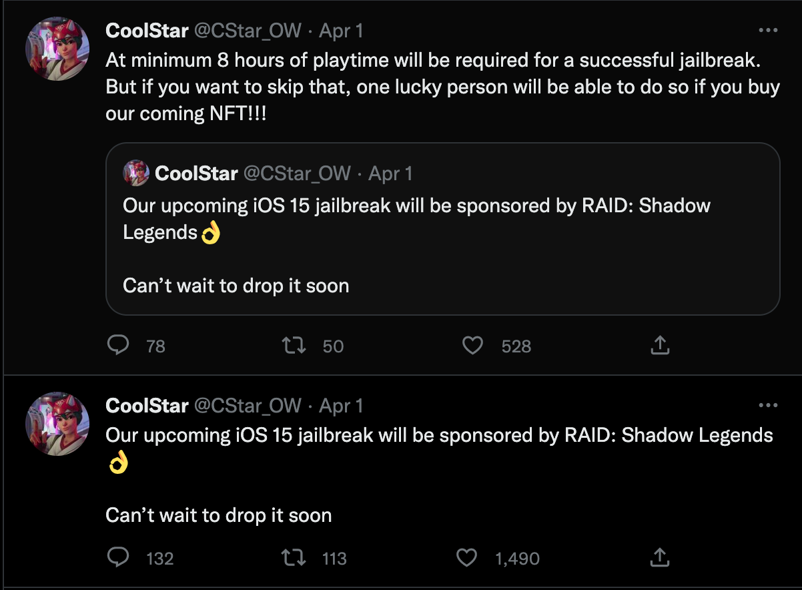

早在2019.3.22,[朱心浪@xina520](https://twitter.com/xina520)就发布了一条推文，提到了越狱圈早有盛名的[Pwn20wnd](https://twitter.com/Pwn20wnd),说着自己也在学习越狱，希望大佬能带飞 。当时还以为是发着玩的，没有太在意，因为那时候大家都在等Pwn20wnd和[CoolStar](https://mobile.twitter.com/CStar_OW)的新工具，毕竟这几年用的越狱工具都是这两位开发的。

在之后的时间里面,xina的确发布了一些关于越狱的视频demo,不过CoolStar的Taurine15(暂命名)项目也开始了。大家还是更看好她。

同时，CoolStar也宣布,Taurine15将是她的最后一个越狱工具。那大家对这个还没真正命名的iOS15越狱工具就更期待了。因为这可能是近几年支持系统版本最高的越狱工具了。

不过随着时间推进越久，酷星好像有其他事要忙，没有太多时间花在iOS15越狱工具上，进度也是偶尔动一下。在今年4.1愚人节，她发了一个推文，说需要玩8个小时游戏才能激活越狱，本来以为是真的有进展了开个小玩笑，但是后面又没什么新的动静了。

然后在今年8月份，酷星公开道歉，说自己实在没有更多的时间花在越狱上面。所以Cheyote(原计划iOS15越狱工具名称)搁浅了。

最后来捋一下iOS15越狱工具Cheyote的情况：

- 已经可以使用并且安装插件，只是会有大量的错误需要修复
- @CoolStar没有专注越狱工作的原因就是忙着赚钱去了
- Cheyote是免费的
- 大概率在iOS16正式发布前iOS15越狱工具也不会发布

没有办法，开发也是需要吃饭的。

但是在xina发布那条推文的三年后，xinaA15越狱工具开始公测了！

在最开始，xina还只是打算做给自己玩，没想着真的能做出来。

结果在2022.11.13，xinaA15开始陆续公测。

不过目前只有rootless，而且很多插件都得等开发者对无根环境进行适配才能正常使用。

敬请期待～
